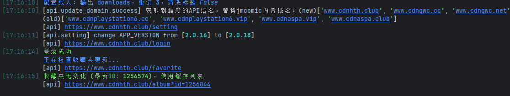
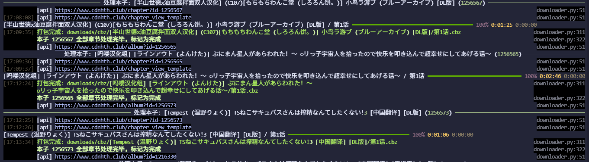

# jm-downloader

18comic下载器，基于[JMComic-Crawler-Python](https://github.com/hect0x7/JMComic-Crawler-Python)的二次开发

## 有啥功能？

- [x] 支持监听收藏夹
- [x] 获取收藏夹中的所有本子并下载
- [x] 支持增量下载(不需要重新下载整个收藏夹)
- [x] 将本子的相关信息缓存进数据库
- [x] 支持cbz打包
- [x] 支持根据数据库中的本子信息直接查询相关作者是否有更新
- [x] 支持自定义本子下载id（支持列表）
- [x] 替换了JMComic-Crawler-Python的print log（我不知道为什么要直接print，好好用logging不行吗x）
- [ ] 更多功能有待开发

## 如何使用？

1. 首先先clone仓库
2. 进入项目目录后自行考虑是否使用虚拟环境
3. `pip install -r requirements.txt`
4. `python3 ./cli.py [相关参数]` 即可开始运行！

相关参数

```bash
usage: cli.py [-h] [--config CONFIG] [--album [ALBUM ...]] [--username USERNAME] [--password PASSWORD] [--no-fav] [{download,check-update}]

JM 收藏下载器 - modular

positional arguments:
  {download,check-update}
                        执行命令: download (默认) 或 check-update

options:
  -h, --help            show this help message and exit
  --config CONFIG, -c CONFIG
                        YAML 配置文件路径
  --album [ALBUM ...], -a [ALBUM ...]
                        指定 album id 列表
  --username USERNAME, -u USERNAME
                        JM 登录用户名
  --password PASSWORD, -p PASSWORD
                        JM 登录密码
  --no-fav              不要下载收藏夹
 ```

## 一些截图




