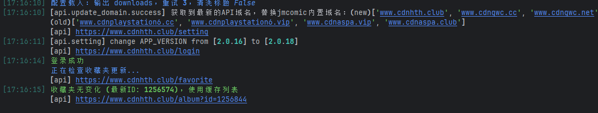
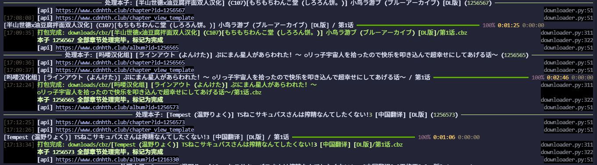

# jm-downloader

18comic下载器，基于[JMComic-Crawler-Python](https://github.com/hect0x7/JMComic-Crawler-Python)的二次开发

## 有啥功能？

- [x] 支持监听收藏夹
- [x] 获取收藏夹中的所有本子并下载
- [x] 支持增量下载(不需要重新下载整个收藏夹)
- [x] 将本子的相关信息缓存进数据库
- [x] 支持cbz打包
- [x] 支持自定义 CBZ 输出目录与原图目录（`cbz_dir` / `originals_dir`）
- [x] 支持打包完成后自动删除原图（`delete_after_pack`）
- [x] 支持根据数据库中的本子信息直接查询相关作者是否有更新
- [x] 作者名自动去重（`DOGYEAR(九条だんぼ)` / `DOGYEAR` / `九条だんぼ` 视为同一作者）
- [x] 搜索本子并导出 JSON / CSV（含 album_id、封面、**总页数**、作者、标签）
- [x] 自带 HTML 选择页：读库展示作者与作品封面，勾选后导出选择文件
- [x] 把选中的作品一键加入 JM 收藏夹
- [x] 支持自定义本子下载id（支持列表）
- [x] 替换了JMComic-Crawler-Python的print log（我不知道为什么要直接print，好好用logging不行吗x）
- [ ] 更多功能有待开发

## 如何使用？

1. 首先先clone仓库
2. 进入项目目录后自行考虑是否使用虚拟环境
3. `pip install -r requirements.txt`
4. `python3 ./cli.py [相关参数]` 即可开始运行！

相关参数（下面是 `python3 ./cli.py --help` 的实际输出）

```bash
usage: cli.py [-h] [--config CONFIG] [--album [ALBUM ...]]
              [--username USERNAME] [--password PASSWORD] [--no-fav]
              [--cbz-dir CBZ_DIR] [--originals-dir ORIGINALS_DIR]
              [--delete-after-pack] [--keep-originals] [--from-file FROM_FILE]
              [--keyword KEYWORD] [--kind {actor,author,site,tag,work}]
              [--limit LIMIT] [--out-dir OUT_DIR] [--no-html] [--no-covers]
              [--cover-limit COVER_LIMIT] [--refresh-covers] [--all-authors]
              [--list] [--add [ADD ...]] [--remove [REMOVE ...]] [--clear]
              [{download,check-update,search,ui,watch,favorite}]

JM 收藏下载器 - modular

positional arguments:
  {download,check-update,search,ui,watch,favorite}
                        执行命令: download(默认) / check-update / search / ui /
                        watch / favorite

options:
  -h, --help            show this help message and exit
  --config, -c CONFIG   YAML 配置文件路径
  --album, -a [ALBUM ...]
                        指定 album id 列表
  --username, -u USERNAME
                        JM 登录用户名
  --password, -p PASSWORD
                        JM 登录密码
  --no-fav              不要下载收藏夹
  --cbz-dir CBZ_DIR     CBZ 输出目录（覆盖配置文件）
  --originals-dir ORIGINALS_DIR
                        原图输出目录（覆盖配置文件）
  --delete-after-pack   CBZ 打包成功后删除对应原图
  --keep-originals      CBZ 打包后保留原图（覆盖配置文件）
  --from-file FROM_FILE
                        HTML 选择页导出的 JSON（selection.json / watchlist.json）
  --keyword, -k KEYWORD
                        搜索关键词
  --kind {actor,author,site,tag,work}
                        搜索方式: site(站内,默认) / author / work / tag / actor
  --limit LIMIT         每个作者 / 每次搜索最多取多少条（默认 10）
  --out-dir, -o OUT_DIR
                        JSON / CSV / HTML 的导出目录（默认 ./jm_ui）
  --no-html             只导出 JSON/CSV，不生成 HTML 页面
  --no-covers           ui: 不联网补全封面/页数（离线生成页面）
  --cover-limit COVER_LIMIT
                        ui: 本次最多补全多少个本子的封面/页数（默认不限，0 表示不补）
  --refresh-covers      ui: 强制重新补全（默认只补从没补过的本子）
  --all-authors         check-update: 忽略监听列表，检查数据库里的全部作者
  --list                watch: 列出当前监听的作者
  --add [ADD ...]       watch: 直接添加作者（可多个）
  --remove [REMOVE ...]
                        watch: 移除作者（可多个）
  --clear               watch: 清空监听列表
```

## 配置说明

不传 `-c` 时，如果当前目录存在 `config.yml` 会**自动读取**它（会在日志里说明读了哪个文件）。
显式传了 `-c` 但文件不存在、或 YAML 顶层不是「键: 值」映射时，会直接报错退出，
不会再静默回退到默认值 —— 否则你以为配置生效了，实际却把本子下到 `./downloads` 去。

```yaml
out_dir: ./jm_downloads      # 根目录
cbz_dir: null                # CBZ 输出目录，null 时用 out_dir/cbz
originals_dir: null          # 原图目录，null 时用 out_dir/originals
retries: 3                   # 单张图片的总尝试次数（含第一次），最小 1
delete_after_pack: false     # 打包成功后删除原图
delete_empty_album_dir: true # 原图删空后是否清理空的本子目录
extract_title: false         # 目录名是否剥掉 [社团] 这类括号内容（会影响目录名，见下）
download_favorites: true     # 是否下载收藏夹（等同不加 --no-fav）
jm_option_file: null         # 指定 jmcomic 的 option.yml（登录/代理等高级配置）
save_db: ./downloads_db.sqlite  # 数据库文件路径
```

> 完整且带注释的版本见仓库里的 `config.yml`。

> 布尔项支持 `true/false`、`yes/no`、`on/off`、`1/0`（大小写不限）。
> 写错的值（比如 `delete_after_pack: maybe`）会明确报错并指出是哪个配置项，
> **不会**被 `bool()` 静默当成 `true` —— 那会导致原图被意外删除。

> 注意：开启 `delete_after_pack` 后原图会被删除，`repacker.py` 将无法再对这些本子重新打包。
> 已打包记录会写入数据库，因此重复运行不会重新下载已打包的章节。

### 关于同名目录

本子目录名取自标题（不含 album_id）。如果两个不同本子的标题清洗后同名
（例如 `extract_title: true` 时 `作品 (作者)` 与 `作品` 都会变成 `作品`），
后一个本子会自动改用 `作品 [album_id]`，避免两本的图片混进同一个目录、cbz 互相覆盖。
目录名会记进数据库，因此重复运行不会改名，`repacker.py` 也能据此找到该目录。

## 重新打包

按数据库里的元数据重新打包**已存在的原图目录**（不会重新下载）。下面是
`python3 ./repacker.py --help` 的实际输出：

```bash
usage: repacker.py [-h] [--config CONFIG] [--username USERNAME]
                   [--password PASSWORD] [--cbz-dir CBZ_DIR]
                   [--originals-dir ORIGINALS_DIR] [--delete-after-pack]
                   [--keep-originals]

JM Repacker - Repack existing folders with new metadata

options:
  -h, --help            show this help message and exit
  --config, -c CONFIG   YAML 配置文件路径
  --username, -u USERNAME
                        JM 登录用户名
  --password, -p PASSWORD
                        JM 登录密码
  --cbz-dir CBZ_DIR     CBZ 输出目录（覆盖配置文件）
  --originals-dir ORIGINALS_DIR
                        原图目录（覆盖配置文件）
  --delete-after-pack   打包成功后删除对应原图
  --keep-originals      打包后保留原图（覆盖配置文件）
```

> 与 `cli.py` 一致：`--keep-originals` 优先于 `--delete-after-pack`，配置文件里的
> `delete_after_pack` 会被命令行覆盖。

## 作者更新检查 + HTML 选择页

HTML 是**静态页面**（数据内嵌，双击即用，不需要起服务）。页面里不能直接写库或调用 JM 接口，
所以流程是「页面勾选 → 导出 JSON → CLI 消费这个 JSON」。

### 1. 选择要监听的作者

```bash
python3 ./cli.py ui                 # 生成 ./jm_ui/authors.html
```

用浏览器打开 `authors.html`：每位作者一张卡片，显示作者名、合并后的别名、作品缩略图与页数，
方便分辨同名/多写法的作者。勾选要持续关注的作者 → 点「导出选择」得到 `watchlist.json`。

> 页面靠封面来分辨作者，而封面只在走过详情请求后才有值。所以 `ui` 在生成页面前会
> **按需补全**库里缺封面/页数的本子（每个本子一次请求，结果会缓存，不会重复请求）。
> 已下架、拿不到页数的本子会被记为「已尝试」不再重试；网络失败的下次会重试。
>
> - `--no-covers`：完全离线生成页面，不补全；
> - `--cover-limit N`：本次最多补 N 个；
> - `--refresh-covers`：强制重新补全（含之前已尝试过的）。

```bash
python3 ./cli.py watch --from-file watchlist.json   # 保存监听列表
python3 ./cli.py watch                              # 查看当前监听列表
```

### 2. 检查更新

```bash
python3 ./cli.py check-update                       # 只检查监听列表里的作者
python3 ./cli.py check-update --all-authors         # 忽略监听列表，检查全部作者
```

每位作者最多取前 10 条搜索结果（`--limit` 可调），只报告数据库里还没有的作品，
并输出 `jm_ui/updates.json`、`updates.csv` 和可勾选的 `updates.html`。

### 3. 搜索 → 选择 → 下载 / 收藏

```bash
python3 ./cli.py search -k DOGYEAR --kind author    # 生成 search_result.json / .csv / .html
```

`search_result.html` 里每张卡片显示封面、album_id、**总页数**、作者、标签与是否已收藏，
可按页数排序、可只看未收藏。勾选后：

```bash
python3 ./cli.py download  --from-file selection.json   # 下载选中的作品
python3 ./cli.py favorite  --from-file selection.json   # 加入 JM 收藏夹
```

> `favorite` 需要登录（`-u/-p` 或写进 `config.yml`）。
> 由于禁漫的收藏接口底层是 toggle，脚本会先确认 `is_favorite` 再操作，
> 已经收藏过的会跳过，**不会**把已有收藏取消掉。

> `jm_ui/` 是生成物目录，已加入 `.gitignore`。

## 一些截图




